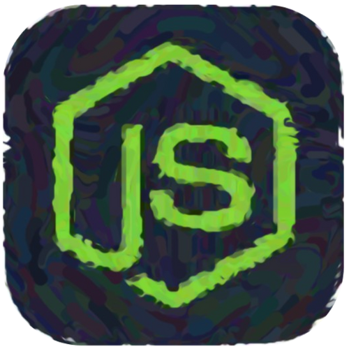

 
 

<!-- 
About:
  -->
<!--   -->

<!-- A former architect and an avid lover of art,  -->
<!-- I appreciate the parallels between the principles of design  -->
<!-- and the principles of coding.  -->
<!--   -->

<!-- The synthesis of structure 
and the freedom of creativity; the 
contemporary, yet recursive nature of innovation. 
These are what moved me to pursue a career in technology, 
and still what moves me every time I code.  -->

 
 

<!-- 
Skills:
 -->

    
    
    
    
    
    

 

    
    
    
    
    
    

 

<!-- Unused -->
<!-- - 

 - -->
<!-- 

 -->
<!--  -->
